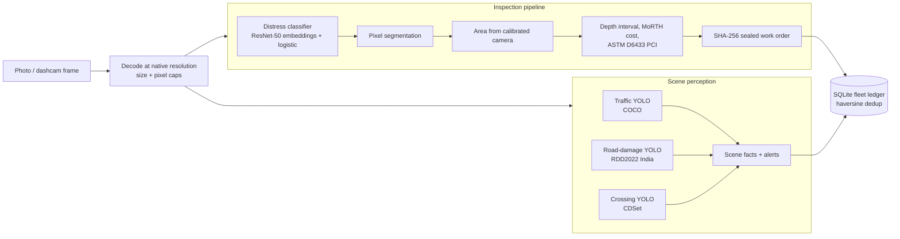

# ROAD-SHIELD AI Engine

**Smart India Hackathon 2026 · Problem statement SIH26124 · Bharat Electronics Limited**
AI-assisted road quality assessment using the public bus fleet as a mobile sensing network.

A road photograph goes in; a classified, measured and costed repair record comes
out, sealed so it cannot be quietly altered. Every figure below was measured by
code in this repository, and the code that measures it is included.

---

## What it actually does

| Capability | How it works | Status |
|---|---|---|
| Road distress classification, 7 classes | ResNet-50 ImageNet embeddings (ONNX Runtime) → class-balanced logistic head | **89.2%** on 390 held-out images from 356 unseen photographs |
| — same task, fallback path | HOG + LBP + colour features → PCA → class-balanced RBF SVM | 82.6% on the identical split; serves when no CNN backbone is on disk |
| Object detection, 80 classes | YOLOv8n trained on COCO, served through ONNX Runtime | Working: people, bicycles, cars, buses, trucks, traffic lights, signs |
| **Zebra-crossing detection** | YOLO11n trained on CDSet-3434, re-split by time block (no video leakage) | Test mAP50 **0.869**; finds a crossing in 75.4% of crossing frames with **0 false alarms on 263 crossing-free frames** (old geometric detector: 23.5%, 6 false alarms) |
| **Pothole & crack detection** | YOLO11n on RDD2022 India (D00/D10/D20/D40) | Training: see `checkpoints/detectors/road_damage.json` once shipped |
| INT8 edge build | Static per-channel quantization (`scripts/quantize_models.py`); YOLO heads kept FP32 | Crossing detector: mAP50 0.864 → **0.858**, 1.3× faster, 2.4× smaller. Classifier backbone: 1.9× faster, −2.6 accuracy points. Opt-in; FP32 stays default |
| IMU shock classification | 100 Hz windows → 0.5–25 Hz Butterworth band-pass → RandomForest | **80.5%** held-out on real field logs; **78.7%** with 35 Hz engine vibration added (60.1% without the filter) |
| Defect **segmentation** | Pixel classifier on 11 features, trained on 4,720 hand-drawn polygons | **crack IoU 0.232, pothole IoU 0.154** on 500 unseen photographs |
| Defect **area** | Each mask pixel's own ground footprint, summed | Measured — a bounding box overstates a diagonal crack ~13× |
| Camera **calibration** | Per-device profile from a checkerboard or published FOV | Per vehicle; 30 cm of mount height moves area ~46% |
| Defect **depth** | IRC band placed by measured extent / cavity contrast | **Estimate with an interval**, never a measurement |
| Video ingest | cv2 decode, frames sampled by ground distance, pHash suppression | Real decoding; refuses to invent GPS |
| Fleet ledger | SQLite, raw sightings kept as the dedup audit trail | Survives restart |
| Repair costing | MoRTH Section 500 bitumen tonnage and rates | Deterministic |
| Pavement condition index | ASTM D6433 deduct-value procedure | Deterministic |
| Tamper-proof work orders | SHA-256 seal over the order fields | Verified by tests |
| Fleet deduplication | Haversine distance clustering of reports | Verified by tests |
| Repair verification | SSIM + Laplacian variance + perceptual hash | Catches resubmitted photographs |
| Sensor fusion | Bayesian gate over vision + IMU evidence | Reports "unavailable" when no IMU window exists |
| GIS services | Google Maps if a key is set, else OpenStreetMap Nominatim / OSRM / Overpass / Open-Meteo | Reports UNAVAILABLE rather than inventing data |
| Frame-quality gate | Laplacian texture, luminance and glare on the road region | Keeps **100%** of 450 real road frames; catches 100% covered-lens / severe defocus, 98% whiteout |
| Repair Priority Index | PI from measured PCI, volume and traffic only | Deterministic; a test pins that locality cannot change a score |
| Edge event packets | ≤ 1,024-byte JSON, HMAC-SHA256 per device, people as counts only | Size guaranteed by construction; tampering rejected |
| Privacy redaction (DPDP) | People blurred from detections; plates from a trained plate detector | People: always. Plates: when `license_plate` is trained, otherwise stated as not done |
| Congestion index | IRC:106 PCU over vehicles counted by the detector | Counts are detected or caller-supplied, never defaulted |

**Checked against the Milestone 2 report:** [docs/REPORT_ALIGNMENT.md](docs/REPORT_ALIGNMENT.md) maps every claim in the report to its code, test and measured number, and lists the corrections.

## The measurement chain

The classifier's 89.2% is measured. Everything *after* it decides the rupee
figure, and those stages are now labelled individually — because half are
measurements and half are estimates:

| Stage | What it is | Provenance |
|---|---|---|
| Classification | ResNet-50 embeddings → logistic head | **measured**, 89.2% |
| Segmentation | pixel classifier on 4,720 real polygons | **measured**, crack IoU 0.232 |
| Area | each mask pixel's ground footprint, summed | **measured** *if* the camera is calibrated |
| Camera geometry | per-device profile, rescaled per request | **measured** with a profile, **estimate** without |
| Depth | IRC band placed by extent or cavity contrast | **estimate**, always with an interval |
| Cost | MoRTH Section 500 × area × depth | **range**, because depth is a range |

Measured on one photograph through the API: with the assumed mount the defect
comes out at 0.007 m² and ₹4.5; with a calibrated profile for the same vehicle,
0.049 m² and ₹34.5. Seven times. That is why calibration is not a detail, and
why every response carries the provenance of the numbers in it.

## Measured performance

| Test | Result |
|---|---|
| Held-out accuracy | **89.2%**, macro-F1 0.675, on 390 images from 356 unseen photographs (random guess 14.3%) |
| Same split, hand-crafted features | 82.6%, macro-F1 0.642 |
| Same split, ResNet-50 + SVC-RBF head | 86.9%, macro-F1 0.609 |
| Grouped 5-fold cross-validation (baseline features) | 84.1% ± 1.8, macro-F1 0.696 |
| Leakage audit | 0 cross-class duplicates, 0 groups spanning splits |
| Calibration (ECE, baseline) | 0.064 |
| Latency | 33 ms per image for the ResNet-50 embedding, 257 ms full pipeline (p50) |

Reproduce: `python -m training.train_cnn_head --compare`. The test set is split
by source photograph, so no augmented copy of a training image appears in it,
and it is scored once.

### Per class — ResNet-50 embeddings + logistic head

| Class | Precision | Recall | F1 | Test images |
|---|---|---|---|---|
| Normal Road / Sound Pavement | 0.98 | 0.90 | 0.94 | 140 |
| Crack (Longitudinal / Transverse / Alligator) | 0.84 | 0.91 | 0.87 | 120 |
| Pothole Cavity | 0.89 | 0.90 | 0.90 | 120 |
| Waterlogging / Flooding Hazard | 0.50 | 1.00 | 0.67 | 2 |
| Missing Zebra Crossing | 0.25 | 0.33 | 0.29 | 3 |
| Missing Road Divider | 0.50 | 0.33 | 0.40 | 3 |
| Damaged Traffic Sign | 1.00 | 0.50 | 0.67 | 2 |

The three classes carrying the workload — normal, crack, pothole — are scored on
380 of the 390 test images and sit between 0.87 and 0.94 F1. The other four have
two or three test images each, so their F1 moves by 0.3 or more on a single
image and is not a stable measurement of anything. Macro-F1 of 0.675 is
dominated by that noise, which is why both numbers are reported rather than
whichever one flatters the model. It is a data volume problem, it is visible on
the dashboard's model card, and it is not hidden behind an average.

## Data

| # | Class | Images | Distinct photographs |
|---|---|---|---|
| 0 | Normal Road / Sound Pavement | 1807 | ~1580 |
| 1 | Crack (Longitudinal / Transverse / Alligator) | 2413 | ~2400 |
| 2 | Pothole Cavity | 1404 | ~1400 |
| 3 | Waterlogging / Flooding Hazard | 14 | 14 |
| 4 | Missing Zebra Crossing | 19 | 19 |
| 5 | Missing Road Divider | 20 | 20 |
| 6 | Damaged Traffic Sign | 14 | 14 |

2,373 distinct photographs in total after the Kaggle ingest. The imbalance is
the point: classes 3-6 are the ones holding macro-F1 down, and no amount of
modelling substitutes for photographs of them.

**Primary source:** *Cracks and Potholes in Road Images* — 2,235 photographs
collected by DNIT, the Brazilian federal highway department, with 1,921 crack
and 564 pothole polygon annotations. Each annotated defect is cropped into a
training example by `scripts/fetch_cracks_potholes_dataset.py`.
Original: github.com/biankatpas/Cracks-and-Potholes-in-Road-Images-Dataset ·
COCO conversion: github.com/andrijdavid/Cracks-and-Potholes-in-Road-Images-Dataset

**Kaggle:** four datasets pulled through the official API — surface cracks
(concrete, close range: real crack texture but not road scenes), and three
pothole/plain-road sets. `virenbr11/pothole-and-plain-rode-images` turned out to
be 94% a re-upload of `atulyakumar98/pothole-detection-dataset`; 700 of its 739
images were rejected as perceptual duplicates. That check is the difference
between an honest score and an inflated one.

A fifth, `andrewmvd/road-sign-detection`, was removed after it went in: it is a
dataset of road signs, not damaged road signs, so the model learned "a sign is
present" under a label claiming "this sign is damaged". Removing its 299 images
raised accuracy from 88.5% to 89.2%.

**Smaller classes:** Wikimedia Commons and Geograph photographs.

**Object detection:** COCO, 330,000 images, through the published YOLOv8n weights.

**IMU:** 852 one-second windows (688 train / 164 held-out, split by time
block with a guard gap) cut from real accelerometer logs of Indian road drives
(VishalSingh25/Pothole-Project: plain road, unmarked and marked speed
breakers, pothole corridors). Recorded from a road vehicle, not yet a bus: the
band-pass filter and the engine-vibration test exist because a bus-mounted
sensor will see vibration these logs do not contain.

**Not Indian road data.** The photographs are Brazilian. RDD2022 provides
47,000 annotated images including India and is the obvious next step; the
downloader is written and waiting on a GPU.

### Segmentation — measured

| Class | IoU | Dice | Pixel precision | Pixel recall |
|---|---|---|---|---|
| Crack | 0.232 | 0.376 | 0.414 | 0.345 |
| Pothole | 0.154 | 0.266 | 0.320 | 0.228 |

500 unseen photographs, split by photograph, scored only on pixels inside the
lane polygon. Trained on 5.6 million labelled pixels from 4,720 hand-drawn
polygons. The decision is a per-class threshold tuned for IoU on a separate
calibration split rather than argmax — with ~97% of pixels being sound road,
argmax floods the mask with false positives, and fixing that alone took crack
IoU from 0.154 to 0.187 before more data took it to 0.232.

These are working numbers, not solved ones. What they replace is a bounding box
that had no measured accuracy at all.

## Deployment

```bash
docker build -t road-shield .
docker run -p 8000:8000 -v "$PWD/checkpoints:/app/checkpoints" road-shield
```

The checkpoints volume carries the trained models and the SQLite ledger; without
it the container starts with neither, and the `/system` page says so. No CUDA and
no PyTorch — the CNN runs on ONNX Runtime on the CPU.

GitHub Actions runs the suite on 3.11 and 3.12, checks every module imports,
and lints the modules held to the standard. The test suite starts the server
in-process and exercises the API over HTTP.

`ROAD_SHIELD_DATA_DIR` moves everything the server writes at runtime (the
ledger, feedback logs) out of `checkpoints/`; point it at a volume in
production.

## The site

Nine pages, not one dashboard file:

| Page | What it is for |
|---|---|
| `/` | overview and the honest limits |
| `/inspect` | analyse a photograph; mask, area, depth interval, cost range |
| `/detect` | scene detection: potholes, cracks, zebra crossings, people, vehicles, signals |
| `/video` | dashcam ingest, sampled by ground distance |
| `/corridor` | fleet map and the deduplication ledger |
| `/works` | costing and the SHA-256 tamper demonstration |
| `/models` | model card, per class, including what scores badly |
| `/data` | dataset lineage, duplicate rejection, what the data misses |
| `/system` | components, calibration, storage, live endpoint self-test |

Measured and estimated numbers are visually distinguished on every page. On this
system that is a correctness requirement, not decoration.

## Running it

```bash
pip install -r requirements.txt
python -m scripts.run_full_pipeline                            # everything below, in one command
```

Or stage by stage:

```bash
python -m scripts.fetch_cracks_potholes_dataset --limit 2235   # ~70 s, real data
python -m training.train_mega_suite                            # ~3 min, baseline models
python -m scripts.fetch_cnn_backbone                           # 98 MB ResNet-50, once
python -m training.train_cnn_head --compare                    # ~4 min, the 89.2% model
python -m api.server                                           # http://127.0.0.1:8000/dashboard
```

On startup the server prints which classifier it loaded. `deep CNN embeddings
(cnn:resnet50+logistic)` is the 89.2% path; `HOG/LBP + SVM baseline` means the
backbone is missing and it fell back. On a slow machine,
`python -m scripts.fetch_cnn_backbone --model mobilenetv2` is 14 MB and 10 ms
per image instead of 33, at 83.5% accuracy. A head only ever runs with the
backbone it was trained on — the loader pairs them and skips mismatches.

Optional extras:

```bash
python -m scripts.fetch_detector            # COCO object detector (needs ultralytics once)
python -m scripts.validate_models           # leakage, cross-validation, calibration, latency
python -m scripts.model_selection           # compare six classifiers on identical folds
python -m unittest discover -s tests       # full regression suite
python -m training.train_segmenter         # pixel segmentation on the DNIT polygons
python -m scripts.calibrate_camera --list  # camera calibration profiles
python -m training.train_deep_vision        # fine-tune a CNN (needs PyTorch)
```

### Scene detectors (YOLO)

```bash
pip install -r requirements-train.txt

# road damage: RDD2022, Indian subset, ~7,700 images
python -m scripts.fetch_rdd2022 --countries India --train-background-fraction 0.33
python -m training.train_detector configs/detectors/road_damage.yaml

# zebra crossings: CDSet-3434 (download CDSet.zip from
# huggingface.co/datasets/zzd0225/crosswalk-detection-dataset, unzip into datasets/)
python -m scripts.prepare_crosswalk_dataset
python -m training.train_detector configs/detectors/crosswalk.yaml
python -m scripts.benchmark_crosswalk          # learned vs geometric, same frames

# run everything on your own footage
python -m scripts.detect_scene dashcam.mp4 --every 5 --out out/drive
```

`train_detector` writes `checkpoints/detectors/<name>.{pt,onnx,json}`. The JSON
is the model card: config, data licence, per-class thresholds tuned on the
validation split, and box and image-level metrics on the test split. After a
crash or reboot, `--resume` continues from the last completed epoch.

### Kaggle datasets

```bash
pip install kaggle                                   # once
# kaggle.com -> Settings -> API -> Create New Token, save to ~/.kaggle/kaggle.json
python -m scripts.fetch_kaggle_datasets --verify     # what's reachable, downloads nothing
python -m scripts.fetch_kaggle_datasets --plan       # downloads, shows the mapping, copies nothing
python -m scripts.fetch_kaggle_datasets              # ingest
python -m scripts.fetch_kaggle_datasets --undo       # remove every image it added
```

Images are filed by the folder names the dataset actually uses - `potholes/`,
`Positive/`, `plain road/` - not by a layout assumed in advance, and anything
unrecognised is skipped rather than guessed at. Every candidate is perceptually
hashed and dropped if it is a near-duplicate of an image already present:
several Kaggle pothole datasets are re-uploads of each other, and without this
the same photograph lands in both training and test.

The duplicate threshold is measured, not guessed. Over 60 photographs, 64-bit
pHash distance between an image and a copy of it was at most 2 bits after a
JPEG re-encode and at most 8 after a half-size re-upload, while genuinely
different photographs sat at 18 bits and above.

Surface-crack datasets are close-range concrete, not road scenes. They are
real crack images and they help, but the domain gap is real; the catalogue
marks them `domain="concrete"` and the ingest manifest records how many images
came from each domain.

A Google Maps key is optional and not needed for anything in the demo; without
one the system uses OpenStreetMap (Nominatim, OSRM, Overpass) and Open-Meteo,
and reports `UNAVAILABLE` rather than inventing a result.

## How accuracy got here

| Stage | Held-out accuracy | What changed |
|---|---|---|
| Inherited code | 36.6% | Models were untrained; some outputs were fabricated |
| Real training | 36.6% | Genuine classifiers trained on the 133 photographs present |
| Label conflicts fixed | 79.4% | 20 photographs were filed under three contradictory labels at once |
| Real dataset added | 83.4% | 133 → 1,800 distinct photographs |
| ImageNet CNN embeddings | 88.5% | ResNet-50 replaces hand-written features |
| Kaggle ingest + a labelling fix | **89.2%** | 2,373 distinct photographs; removing 299 mislabelled sign images *raised* accuracy |

`scripts/validate_models.py` is what found the label conflicts, by hashing
every image and looking for the same photograph under different labels.

## Honest limitations

- The classifier is a support vector machine on engineered features, not a
  neural network. A CNN fine-tuning script is included but needs PyTorch.
- The photographs are Brazilian, not Indian.
- There is no dashcam video in this repository; the system analyses photographs.
- Four classes have too few examples to work well.
- No demographic inference is performed on people in frame, by design.


---

## Architecture

Two paths share one server. The **inspection pipeline** turns a single road
photograph into a classified, measured and costed repair record. **Scene
perception** finds everything in a dashcam frame at once.



The three perception detectors are separate models on purpose. Each training
set labels only its own classes; a merged model would be taught that every
unlabelled pothole in a crossing photograph is background. Separate models
avoid that and can be retrained, versioned and rolled back independently.

## Project structure

```
api/            HTTP server (stdlib), request-image validation
configs/        detector training configs, one YAML per shipped model
models/         inference: classifiers, segmenter, calibration, YOLO serving,
                road-scene perception, costing, sealing
pipeline/       end-to-end inspection pipeline, video ingest, fleet ledger
training/       every training entry point; train_detector.py for the YOLO models
scripts/        dataset fetchers and preparation, validation, benchmarks, CLI tools
checkpoints/    trained models; detectors/ holds ONNX + model card per detector
datasets/       bundled evaluation corpus (downloaded training sets are git-ignored)
web/            the site: one HTML file per page plus shared app.js / app.css
tests/          unittest suite, run by CI on Python 3.11 and 3.12
```

## API

The server is `python -m api.server` (port 8000). Main endpoints:

| Endpoint | Purpose |
|---|---|
| `POST /api/v1/perception/analyze` | potholes, cracks, crossings, people, vehicles, signals; scene facts and alerts |
| `GET /api/v1/perception/status` | which detectors are loaded, their thresholds and held-out test metrics |
| `POST /api/v1/pipeline/deep-audit` | full inspection pipeline: class, mask, area, depth interval, cost, PCI |
| `POST /api/v1/vision/predict` | 7-class distress classification only |
| `POST /api/v1/detect/objects` | COCO objects only |
| `POST /api/v1/pedestrian/detect` | pedestrian risk; counts are detected when an image is sent |
| `POST /api/v1/video/ingest` | dashcam file, frames sampled by ground distance |
| `POST /api/v1/fleet/report-defect` | add a sighting to the deduplicated ledger |
| `POST /api/v1/dispatch/work-order`, `/dispatch/verify-seal` | sealed work orders |
| `GET /api/v1/health` | model status |

```bash
curl -s http://127.0.0.1:8000/api/v1/perception/analyze \
  -H "Content-Type: application/json" \
  -d "{\"image_base64\": \"$(base64 -w0 frame.jpg)\", \"return_annotated\": true}"
```

The response carries every detection (`class_name`, `group`, `confidence`,
`bbox_pixels`, `model`), per-class `counts`, `scene` facts, prioritised
`alerts`, the models that were `unavailable_models`, and per-model latency.
`groups: ["damage"]` runs only the road-damage detector, for maintenance
surveys where people and traffic are noise.

**Image inputs.** `image_base64` is decoded strictly as base64 and is never
interpreted as a file path. `image_path` is accepted only for files inside
`datasets/` (after resolving `..` and symlinks). Request bodies are capped at
~55 MB and images at 40 megapixels. Annotated images the server returns have
people blurred unless the request sets `"redact_people": false`.

## Tests

```bash
python -m unittest discover -s tests -p "test_*.py"
```

CI (`.github/workflows/ci.yml`) runs the suite on Python 3.11 and 3.12, imports
every module, and lints the modules listed in its Lint step with `ruff`.
Tests that need trained weights skip, visibly, when the weights are absent; the
integration tests for the trained detectors run whenever
`checkpoints/detectors/` is populated.

## Licences

| Component | Licence | Consequence |
|---|---|---|
| RDD2022 (road-damage training data) | CC BY-SA 4.0 | the `road_damage` weights are a derivative; share-alike applies |
| CDSet-3434 (crossing training data) | Apache-2.0 | attribution |
| Ultralytics YOLO code and pretrained weights | AGPL-3.0 | applies to the three YOLO detectors, including the ones fine-tuned here; offering them as a network service triggers AGPL source obligations |
| ImageNet ResNet-50 / MobileNetV2 (ONNX Model Zoo) | Apache-2.0 | attribution |

Anyone taking this beyond academic use must review these, the AGPL above all.

---

## 👥 Team

**Team:** Road Shield AI  
**SIH Problem:** SIH26124 — Bharat Electronics Limited (BEL)  
**Theme:** Smart Automation  
**Developer:** Udbhav Yadav  

---

## 📄 License

This project is developed for **Smart India Hackathon 2026** under academic/research use.  
Third-party data and model licences are listed under [Licences](#licences).

---

<p align="center">
  <b>🛡️ ROAD-SHIELD | Protecting Indian Roads, One Bus at a Time</b><br>
  <sub>Built with ❤️ for Bharat Electronics Limited · MoRTH/NHAI · Smart India Hackathon 2026</sub>
</p>
